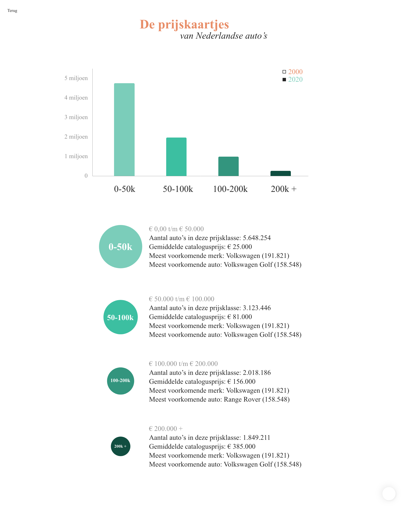

# TechTrack-v2
<em>Additions to the 2020 Tech-Track.</em>

Table of content:
- [Install](#install)
- [Final concept](#final-concept)
  - Prototype
  - Proces 
  - Code
- [Credits & License](#credits--license)

# Install
Within 3 steps you can use my project and dive into the codelines.

1. Clone this repository to your local files
```js
git clone https://github.com/davidvanr21/TechTrack-v2.git
```
2. Then ```$ cd``` into the project folder.
```js
npm install
```
3. Now run the project!
```js
npm run dev
```

# Process & Concept
## Debrief Volkskrant
> Find interesting relationships between several variables to create new insights about cars in the city.

A super intereting subject that can be interpreted in very different ways. The insights we could discover are meant for journalistic end use. The data we worked with are all coming from [RDW](https://opendata.rdw.nl/browse?category=Parkeren&provenance=official). 

## Code
For the coding I need the following data for each car:
- hoi

It will then look like this:
```js
[
  Auto 1 {
    “kenteken”:”ZT485G”
    "voertuigsoort": "Personenauto"
    "catalogusprijs": "13320"
    "datum eerste toelating": "20190823"
 }
]
```

## Research & Iterations

## Prototype
Watch the prototype that I've made in Adobe XD [here](https://xd.adobe.com/view/1e9ea04d-a1aa-40b8-9b5f-229c5f7e1a55-4bcd/?fullscreen).

To make my concept clear to the client, I've made a prototype in Adobe XD. This tool doesn't required code so I could focus more on the concept itself and the story behind it. The page which contains the most data that's visible for the user is this one:

 

<em>(It doesn't contain real data)</em>


# Credits & License
## Credits
Great lectures given by:
- [Laurens Aarnoudse](https://github.com/Razpudding)
- [Danny de Vries](https://github.com/dandevri)
- [Robert Spier](https://github.com/roberrrt-s)

There are a few people that helped me out with problems or something else. Therefore a big shoutout to:
- [Chelsea Doeleman](https://github.com/chelseadoeleman)
- [Ralf Zonneveld](https://github.com/ralfz123)

## License & Copyright
Licensed under the [MIT License](https://github.com/davidvanr21/functional-programming/blob/main/LICENSE) by © [David van Rumpt](https://github.com/davidvanr21), 2021
